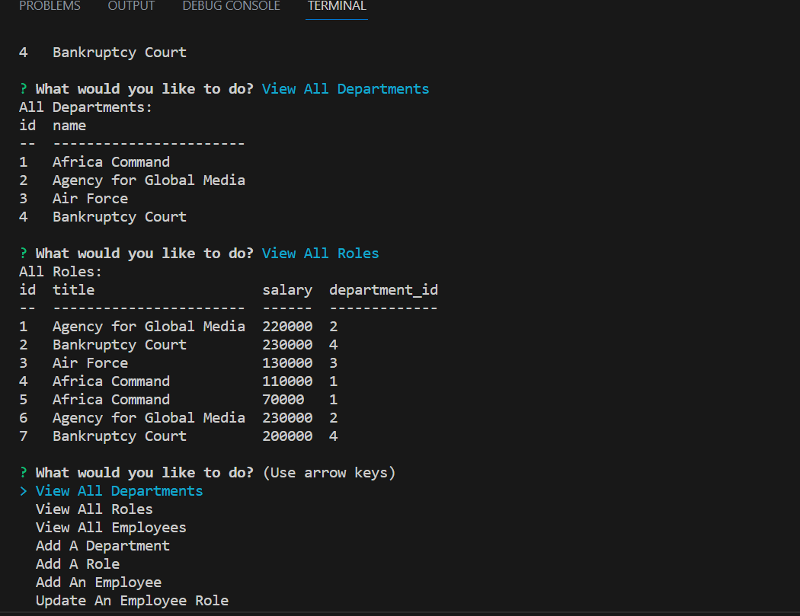

## Business Management App

## Description 
The Business Management App is a command-line application that allows users to manage departments, roles, and employees of a business. It provides an interface to view, add, and update data in a MySQL database.

## Table of Contents

- [Installation](#installation)
- [Usage](#usage)
- [Features](#features)
- [Contributing](#contributing)
- [License](#license)

## Installation

1. Clone the repository to your local machine.
2. Install the required dependencies by running the following command:
3. Set up the MySQL database by executing the SQL script provided in `database.sql`.

## Usage

1. Configure the database connection in the `index.js` file by providing the appropriate values for the `host`, `port`, `user`, `password`, and `database` properties in the `db` object.
2. Run the application using the following command: node index
3. The app will present a menu with various options. Select an option by using the arrow keys and pressing Enter.
4. Follow the prompts to perform different operations, such as viewing departments, roles, and employees, adding new entries, and updating existing records.

## Features

- View all departments: Display a list of all departments in the business.
- View all roles: Show a list of all job roles in the organization.
- View all employees: View details of all employees, including their names, roles, and managers.
- Add a department: Create a new department and store it in the database.
- Add a role: Define a new job role and associate it with a department.
- Add an employee: Register a new employee in the system and assign them a role and manager.
- Update an employee role: Change the job role of an existing employee.
- Exit: Terminate the application.

## Contributing

Contributions to the Business Management App are welcome! If you have any ideas, suggestions, or bug reports, please submit them by creating a new issue or sending a pull request with your changes.

## License

This project is licensed under the [MIT License](LICENSE).
